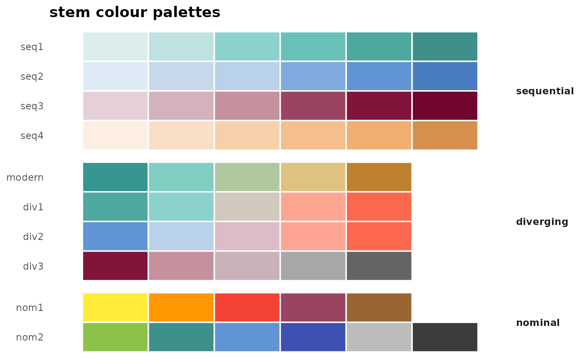
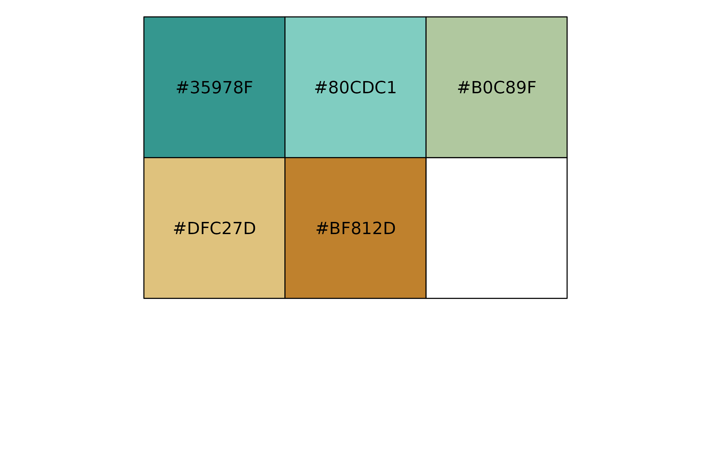
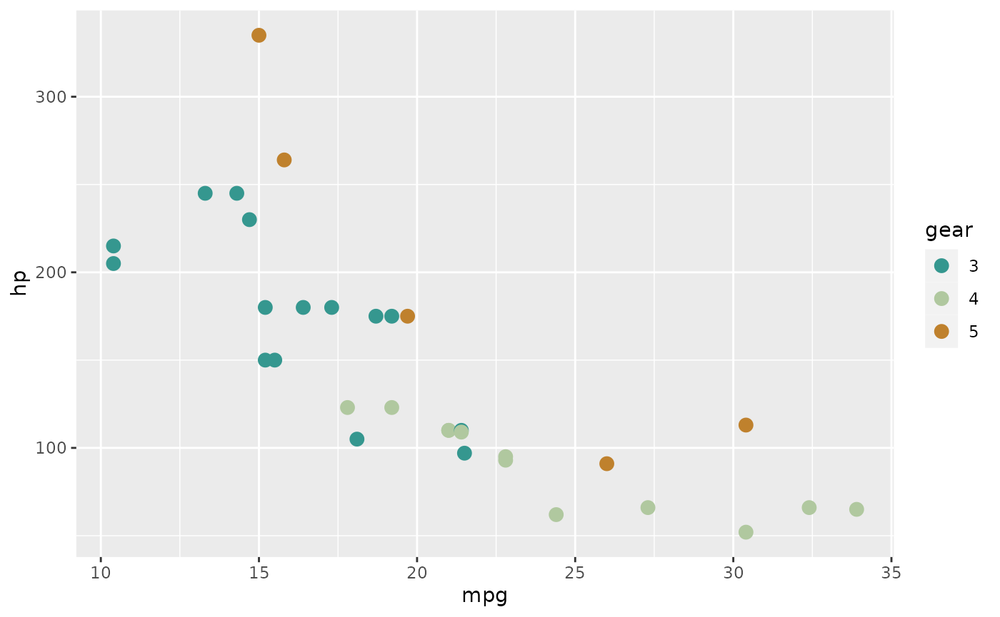

# Color Palettes in stemtool

`stemtool` provides a set of color palettes for plotting. Every palette
lives in a single registry (`.stem_palettes`), and each one is tagged
with a *type* that all the other palette functions read from. There are
three types of palettes:

- **Diverging** - used for variables where low values are the opposite
  of high values. Typically likert items, where low values signify
  agreement and high values signify disagreement.

  - Available diverging palettes: `modern`, `div1`, `div2`, `div3`.

- **Nominal** - used for variables where categories have no set order.
  Typically gender, countries of origin or occupation.

  - Available nominal palettes: `nom1`, `nom2`.

- **Sequential** - used for variables where higher values indicate
  higher frequency/concentration of something. Typically level of
  unemployment, number of people with tertiary education or
  socioeconomic class.

  - Available sequential palettes: `seq1`, `seq2`, `seq3`, `seq4`.

You can see every palette at a glance with
[`stem_palettes_all()`](https://stem-cz.github.io/stemtools/reference/stem_palettes_all.md):

``` r

stem_palettes_all()
```



## Accesing `stemtool` palettes

Color codes from a palette are accessed with the
[`stem_palette()`](https://stem-cz.github.io/stemtools/reference/stem_palette.md)
function, which expects a palette name (see above) and returns all of
its colors. The returned vector carries a `type` attribute. Palettes can
be visually inspected with `show_col()` from the `scales` package:

``` r

stem_palette("modern")
#> [1] "#35978F" "#80CDC1" "#B0C89F" "#DFC27D" "#BF812D"
#> attr(,"type")
#> [1] "diverging"
attr(stem_palette("modern"), "type")
#> [1] "diverging"
show_col(stem_palette("modern"))
```



To pull a specific number of colors (for diverging palettes, sampled
symmetrically around the midpoint), use the generator returned by
[`stem_palette_gen()`](https://stem-cz.github.io/stemtools/reference/stem_palette_gen.md):

``` r

stem_palette_gen("modern")(3)
#> [1] "#35978F" "#B0C89F" "#BF812D"
```

## Using palettes in `ggplot2`

Palettes can be used in `ggplot2` figures by using functions
[`scale_color_stem()`](https://stem-cz.github.io/stemtools/reference/scale_colour_stem.md)
and
[`scale_fill_stem()`](https://stem-cz.github.io/stemtools/reference/scale_colour_stem.md).
Specific palette can be chosen by `palette` argument, using
`direction = -1` can be used to reverse the order of colors. Note that
for diverging palettes, colors are used from both ends of the palette in
an alternating pattern.

``` r

mtcars |> 
  within(gear <- as.factor(gear)) |> 
  ggplot(aes(x = mpg,
             y = hp,
             color = gear)) +
  geom_point(size = 3) +
  scale_color_stem(palette = "modern")
```


