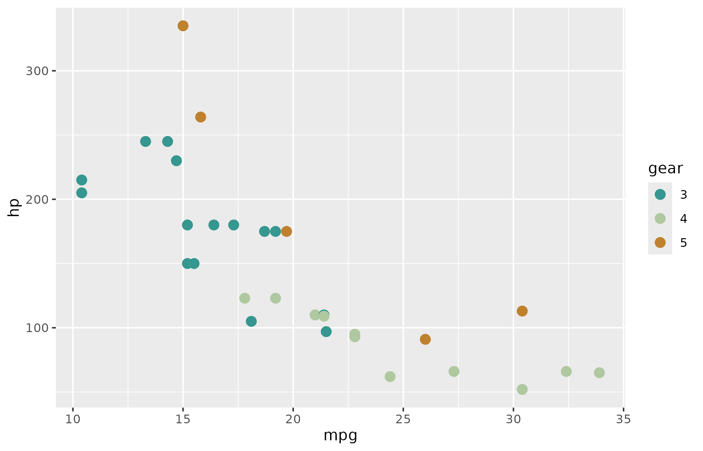
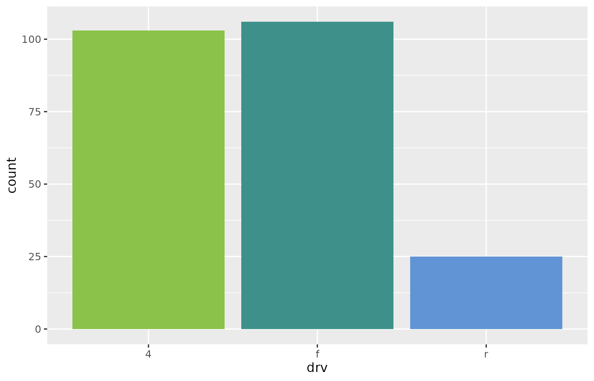
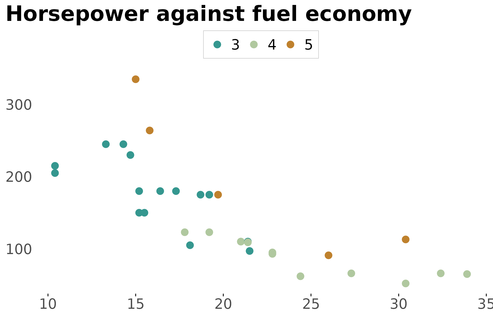
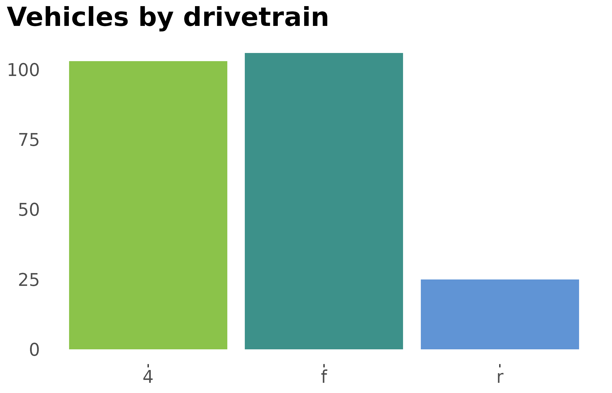

# Colour palettes and the Stem theme

``` r

library(stemtools)
library(ggplot2)
library(scales)
```

[stemtools](https://github.com/stem-cz/stemtools) ships a set of colour
palettes and a complete [ggplot2](https://ggplot2.tidyverse.org) theme
that together give plots the Stem look. This vignette shows how to
browse the palettes, use them the same way you would any other palette
in [ggplot2](https://ggplot2.tidyverse.org), and how to switch on
[`theme_stem()`](https://stem-cz.github.io/stemtools/reference/theme_stem.md).

## Available palettes

Every palette lives in a single registry, and each one is tagged with a
*type* that all the other palette functions read from. There are three
types:

- **Nominal** – for variables whose categories have no inherent order
  (gender, country of origin, occupation).

  - Available nominal palettes: `nom1`, `nom2`.

- **Sequential** – for ordered variables where higher values mean *more*
  of something (level of unemployment, share with tertiary education,
  socioeconomic class).

  - Available sequential palettes: `seq1`, `seq2`, `seq3`, `seq4`.

- **Diverging** – for variables with a meaningful midpoint, where low
  values are the opposite of high values (typically Likert items running
  from agreement to disagreement).

  - Available diverging palettes: `modern`, `div1`, `div2`, `div3`.

The quickest way to see everything at a glance is
[`stem_palettes_all()`](https://stem-cz.github.io/stemtools/reference/stem_palettes_all.md),
which draws every palette as a row of colour tiles, grouped by type
(much like
[`RColorBrewer::display.brewer.all()`](https://rdrr.io/pkg/RColorBrewer/man/ColorBrewer.html)):

``` r

stem_palettes_all()
```


## Accessing palette colours

The hex codes for a single palette are returned by
[`stem_palette()`](https://stem-cz.github.io/stemtools/reference/stem_palette.md),
which takes a palette name and returns all of its colours. The returned
vector carries a `type` attribute, and can be inspected visually with
[`show_col()`](https://scales.r-lib.org/reference/show_col.html) from
[scales](https://scales.r-lib.org):

``` r

stem_palette("modern")
#> [1] "#35978F" "#80CDC1" "#B0C89F" "#DFC27D" "#BF812D"
#> attr(,"type")
#> [1] "diverging"

attr(stem_palette("modern"), "type")
#> [1] "diverging"

show_col(stem_palette("modern"))
```


To pull a specific number of colours, use the generator returned by
[`stem_palette_gen()`](https://stem-cz.github.io/stemtools/reference/stem_palette_gen.md).
For diverging palettes the colours are sampled symmetrically around the
midpoint rather than simply taken from the front of the palette:

``` r

stem_palette_gen("modern")(3)
#> [1] "#35978F" "#B0C89F" "#BF812D"
```

## Using palettes in `{ggplot2}`

Stem palettes plug into [ggplot2](https://ggplot2.tidyverse.org) exactly
like the built-in `scale_*_brewer()` or `scale_*_viridis_d()` scales.
Reach for
[`scale_colour_stem()`](https://stem-cz.github.io/stemtools/reference/scale_colour_stem.md)
(or its American alias
[`scale_color_stem()`](https://stem-cz.github.io/stemtools/reference/scale_colour_stem.md))
for the `colour` aesthetic and
[`scale_fill_stem()`](https://stem-cz.github.io/stemtools/reference/scale_colour_stem.md)
for `fill`. Pick a palette with the `palette` argument and, if needed,
flip its order with `direction = -1`:

``` r

mtcars |>
  within(gear <- as.factor(gear)) |>
  ggplot(aes(x = mpg, y = hp, colour = gear)) +
  geom_point(size = 3) +
  scale_colour_stem(palette = "modern")
```



Because these are ordinary discrete scales, any argument accepted by
[`ggplot2::discrete_scale()`](https://ggplot2.tidyverse.org/reference/discrete_scale.html)
– `name`, `breaks`, `labels`, and so on – can be passed straight
through. Here is a `fill` scale using a nominal palette:

``` r

ggplot(mpg, aes(x = drv, fill = drv)) +
  geom_bar() +
  scale_fill_stem(palette = "nom2") +
  guides(fill = "none")
```



## The Stem theme

[`theme_stem()`](https://stem-cz.github.io/stemtools/reference/theme_stem.md)
is a *complete* [ggplot2](https://ggplot2.tidyverse.org) theme carrying
the Stem look: no gridlines, a top legend, bold titles and the Stem
house font. Because it is complete, you activate it once with
[`ggplot2::theme_set()`](https://ggplot2.tidyverse.org/reference/get_theme.html)
and every subsequent plot picks it up:

``` r

theme_set(theme_stem(family = ""))
```

Here `family = ""` falls back to the graphics device’s default font,
which is handy on machines where the Stem house font (Calibri) is not
installed. In day-to-day use you can simply call
[`theme_stem()`](https://stem-cz.github.io/stemtools/reference/theme_stem.md)
with no arguments.

With the theme active, the same plot as above now carries the Stem
styling automatically:

``` r

mtcars |>
  within(gear <- as.factor(gear)) |>
  ggplot(aes(x = mpg, y = hp, colour = gear)) +
  geom_point(size = 3) +
  labs(title = "Horsepower against fuel economy") +
  scale_colour_stem(palette = "modern")
```



You can also add the theme to a single plot with `+ theme_stem()`, and
override individual settings through its arguments – `ink` (foreground),
`paper` (background), and `accent` – or via `...`, which is forwarded to
[`ggplot2::theme()`](https://ggplot2.tidyverse.org/reference/theme.html):

``` r

ggplot(mpg, aes(x = drv, fill = drv)) +
  geom_bar() +
  scale_fill_stem(palette = "nom2") +
  labs(title = "Vehicles by drivetrain") +
  theme_stem(family = "", legend.position = "none")
```



Palettes and the theme are designed to be used together: the `stem_*`
plotting functions rely on the same palettes, and pair naturally with
[`theme_stem()`](https://stem-cz.github.io/stemtools/reference/theme_stem.md)
set for the whole session.
