# Plotting with stemtools

This vignette showcases every plotting function in
[stemtools](https://github.com/stem-cz/stemtools):
[`stem_barplot()`](https://stem-cz.github.io/stemtools/reference/stem_barplot.md),
[`stem_barstack()`](https://stem-cz.github.io/stemtools/reference/stem_barstack.md),
[`stem_inline()`](https://stem-cz.github.io/stemtools/reference/stem_inline.md),
[`stem_battery()`](https://stem-cz.github.io/stemtools/reference/stem_battery.md)
and
[`stem_multiselect()`](https://stem-cz.github.io/stemtools/reference/stem_multiselect.md).
We’ll use the simulated `trust` dataset that ships with the package.

``` r

library(stemtools)
library(ggplot2)

data(trust, package = "stemtools")
head(trust)
#>                       police                 government
#> 1 Neither Agree nor Disagree            Rather Disagree
#> 2           Definitely Agree        Definitely Disagree
#> 3           Definitely Agree        Definitely Disagree
#> 4 Neither Agree nor Disagree            Rather Disagree
#> 5 Neither Agree nor Disagree Neither Agree nor Disagree
#> 6           Definitely Agree Neither Agree nor Disagree
#>                           eu                army                 scientists
#> 1 Neither Agree nor Disagree    Definitely Agree Neither Agree nor Disagree
#> 2 Neither Agree nor Disagree        Rather Agree            Rather Disagree
#> 3               Rather Agree    Definitely Agree            Rather Disagree
#> 4            Rather Disagree    Definitely Agree Neither Agree nor Disagree
#> 5 Neither Agree nor Disagree    Definitely Agree               Rather Agree
#> 6 Neither Agree nor Disagree Definitely Disagree Neither Agree nor Disagree
#>      eu_index   nat_index age         W biggest_concern1 biggest_concern2
#> 1    Likes EU     Neutral  41 0.6452540     Unemployment     Unemployment
#> 2     Neutral   Satisfied  38 0.1800867      Immigration       Corruption
#> 3    Likes EU Disatisfied  39 0.2939668      Immigration       Healthcare
#> 4     Neutral     Neutral  34 0.8033685      Immigration       Healthcare
#> 5    Likes EU   Satisfied  41 0.3471653       Healthcare     Unemployment
#> 6 Dislikes EU Disatisfied  35 1.2082489      Immigration       Healthcare
#>   biggest_concern3
#> 1      Immigration
#> 2      Immigration
#> 3       Corruption
#> 4       Corruption
#> 5      Immigration
#> 6       Corruption
```

## Setting the Stem theme

[`theme_stem()`](https://stem-cz.github.io/stemtools/reference/theme_stem.md)
is a *complete* theme carrying the Stem look. Because it is complete,
the plotting functions do not apply it themselves – instead we switch it
on once with
[`theme_set()`](https://ggplot2.tidyverse.org/reference/get_theme.html)
and every plot from here on picks it up automatically:

``` r

theme_set(theme_stem(family = ""))
```

We pass `family = ""` so the plots fall back to the graphics device’s
default font (the Stem house font, Calibri, may not be installed on
every machine). In normal use you would just call
`theme_set(theme_stem())`.

## How the plotting functions are built

All the plotting functions are composed from a shared frequency core.
Each one calls
[`stem_summarise_cat()`](https://stem-cz.github.io/stemtools/reference/stem_summarise_cat.md)
to compute (possibly weighted) proportions with 95% confidence
intervals, then hands the aggregated data to a
[ggplot2](https://ggplot2.tidyverse.org) template. You can call the
frequency function directly whenever you need the numbers themselves:

``` r

stem_summarise_cat(trust, item = police, group = eu_index, weight = W)
#> # A tibble: 20 × 5
#>    eu_index     police                       freq freq_low freq_upp
#>    <fct>        <fct>                       <dbl>    <dbl>    <dbl>
#>  1 Likes EU     Definitely Agree           0.395   0.327     0.463 
#>  2 Likes EU     Rather Agree               0.318   0.251     0.384 
#>  3 Likes EU     Neither Agree nor Disagree 0.149   0.104     0.194 
#>  4 Likes EU     Rather Disagree            0.0643  0.0264    0.102 
#>  5 Likes EU     Definitely Disagree        0.0734  0.0346    0.112 
#>  6 Neutral      Definitely Agree           0.405   0.330     0.480 
#>  7 Neutral      Rather Agree               0.312   0.242     0.383 
#>  8 Neutral      Neither Agree nor Disagree 0.178   0.117     0.239 
#>  9 Neutral      Rather Disagree            0.0637  0.0297    0.0978
#> 10 Neutral      Definitely Disagree        0.0406  0.00841   0.0728
#> 11 Dislikes EU  Definitely Agree           0.400   0.305     0.495 
#> 12 Dislikes EU  Rather Agree               0.326   0.234     0.418 
#> 13 Dislikes EU  Neither Agree nor Disagree 0.155   0.0778    0.233 
#> 14 Dislikes EU  Rather Disagree            0.0368  0.00956   0.0640
#> 15 Dislikes EU  Definitely Disagree        0.0819  0.0190    0.145 
#> 16 Doesn't Know Definitely Agree           0.308   0.191     0.424 
#> 17 Doesn't Know Rather Agree               0.453   0.315     0.591 
#> 18 Doesn't Know Neither Agree nor Disagree 0.180   0.0871    0.272 
#> 19 Doesn't Know Rather Disagree            0.0139 -0.00215   0.0300
#> 20 Doesn't Know Definitely Disagree        0.0455 -0.00160   0.0926
```

Every plotting function accepts the same core arguments:

- `item` – the categorical variable to plot,
- `group` – an optional grouping variable,
- `weight` – optional survey weights (passed to
  [surveycore](https://github.com/JDenn0514/surveycore)),
- `palette` and `direction` – the [Stem colour
  palette](https://stem-cz.github.io/stemtools/reference/stem_palette.md)
  to use,
- `label_*` – controls for the percentage labels.

## Simple bar plot

[`stem_barplot()`](https://stem-cz.github.io/stemtools/reference/stem_barplot.md)
draws the distribution of a single categorical variable as horizontal
bars, one bar per category.

``` r

stem_barplot(trust, item = government)
```

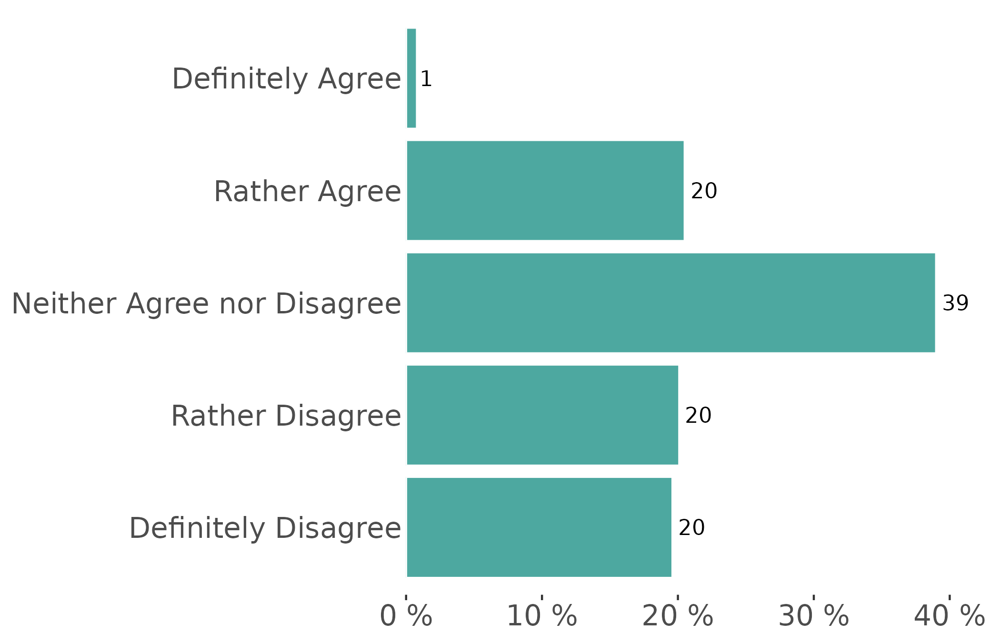

Supplying a `group` variable draws dodged bars so categories can be
compared across groups. Proportions are then computed *within* each
group.

``` r

stem_barplot(trust, item = police, group = eu_index, weight = W)
```

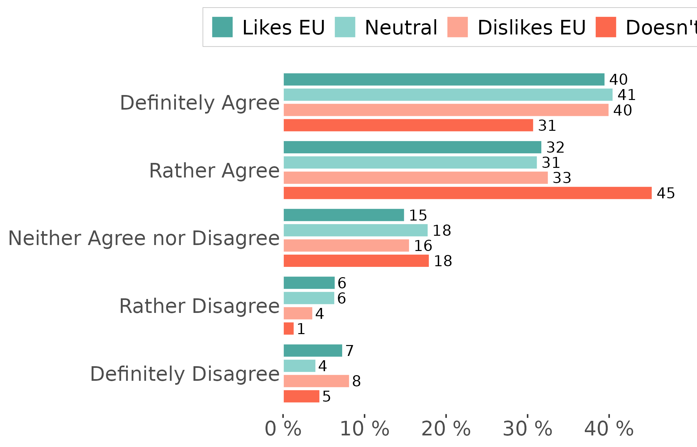

Confidence intervals are always computed and can be shown with
`errorbar = TRUE`.

``` r

stem_barplot(trust, item = government, errorbar = TRUE)
```

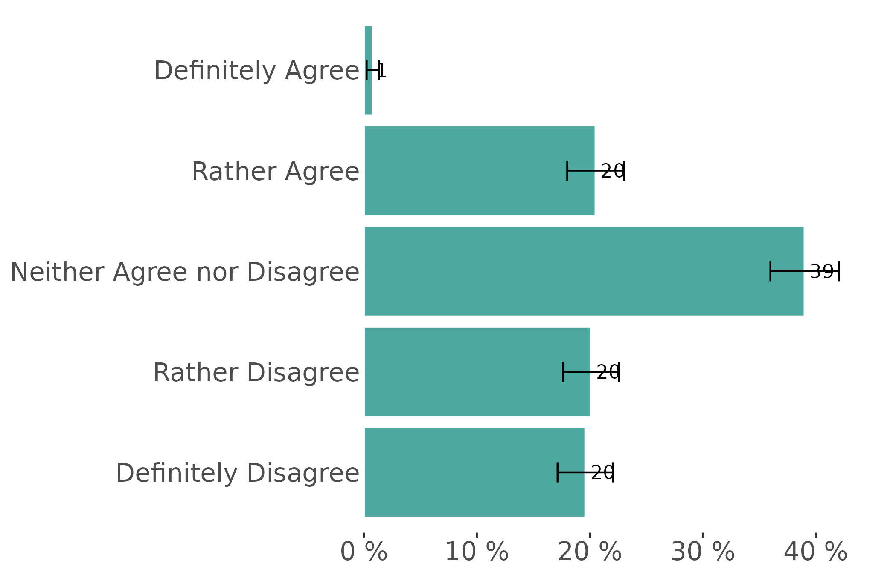

## Stacked bar plot

[`stem_barstack()`](https://stem-cz.github.io/stemtools/reference/stem_barstack.md)
draws one stacked horizontal bar per category of the `group` variable.
Each bar sums to 100%, which makes it easy to compare the composition of
the item across groups.

``` r

stem_barstack(trust, item = police, group = eu_index, weight = W)
```

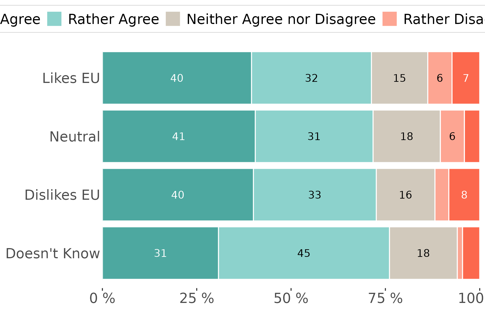

## Inline bar plot

[`stem_inline()`](https://stem-cz.github.io/stemtools/reference/stem_inline.md)
is a compact summary of a single variable as one stacked horizontal bar.

``` r

stem_inline(trust, item = police, weight = W)
```

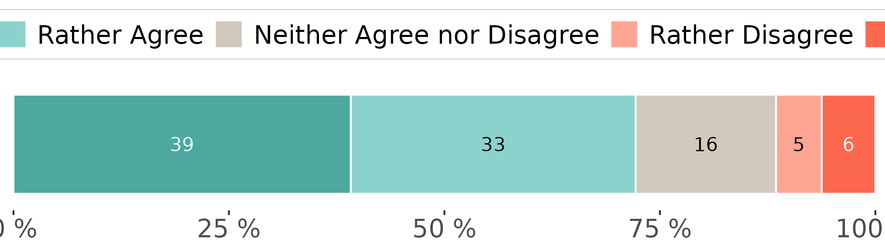

## Battery of like items

[`stem_battery()`](https://stem-cz.github.io/stemtools/reference/stem_battery.md)
plots several variables that share the same response categories (a
Likert battery, say) as one chart, with a stacked bar per item. Pass the
items with tidyselect helpers and, optionally, `order_by` to sort the
items by their combined share of one or more categories.

``` r

stem_battery(trust,
             items = c(police, eu, government, army, scientists),
             weight = W,
             order_by = c("Definitely Agree", "Rather Agree"))
```

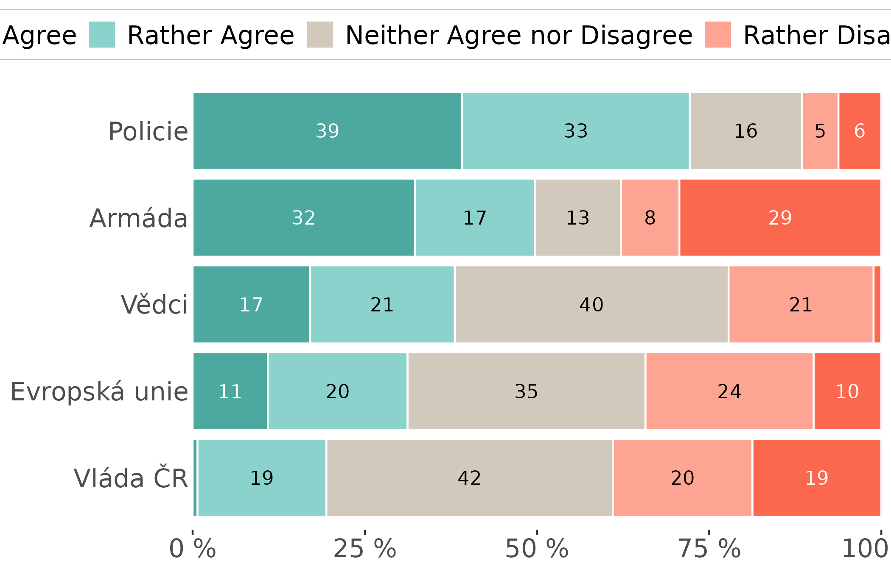

Item labels (the `"label"` attribute) are used automatically when
present; set `item_label = FALSE` to use the bare variable names.

## Multiple-choice items

[`stem_multiselect()`](https://stem-cz.github.io/stemtools/reference/stem_multiselect.md)
summarises a set of “select all that apply” items, rescaling the
frequencies so the bars show the share of *respondents* who picked each
option (rather than the share of responses).

``` r

stem_multiselect(trust, items = dplyr::starts_with("biggest_concern"), weight = W)
```

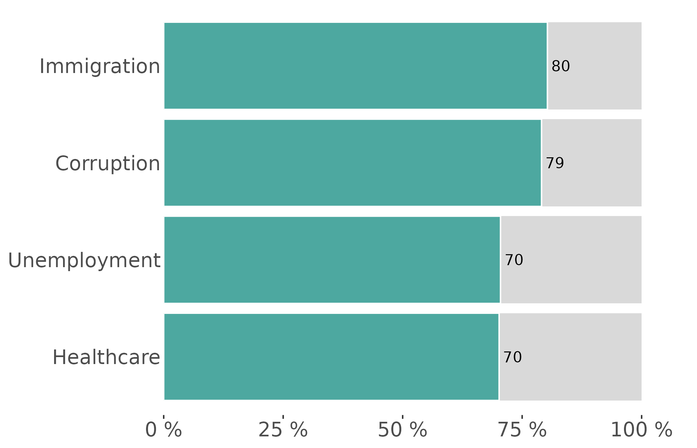

Supplying a `group` variable draws dodged bars for a within-group
comparison.

## Customizing labels

By default the plots print a percentage label on each bar (set
`labels = FALSE` to hide them). `label_accuracy` controls rounding (`1`
for whole numbers, `0.1` for one decimal place), `label_suffix` sets the
text appended to each label and `label_hide` suppresses labels for
proportions below a threshold.

``` r

stem_barstack(trust,
              item = police,
              group = eu_index,
              label_accuracy = 0.1,
              label_hide = 0.1)
```

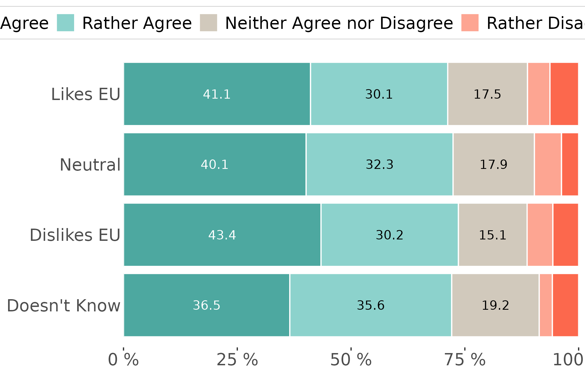

## Colours

Use `palette` to pick one of the [Stem
palettes](https://stem-cz.github.io/stemtools/reference/stem_palette.md)
and `direction = -1` to reverse it.

``` r

stem_barstack(trust, item = police, group = eu_index, palette = "div2")
```

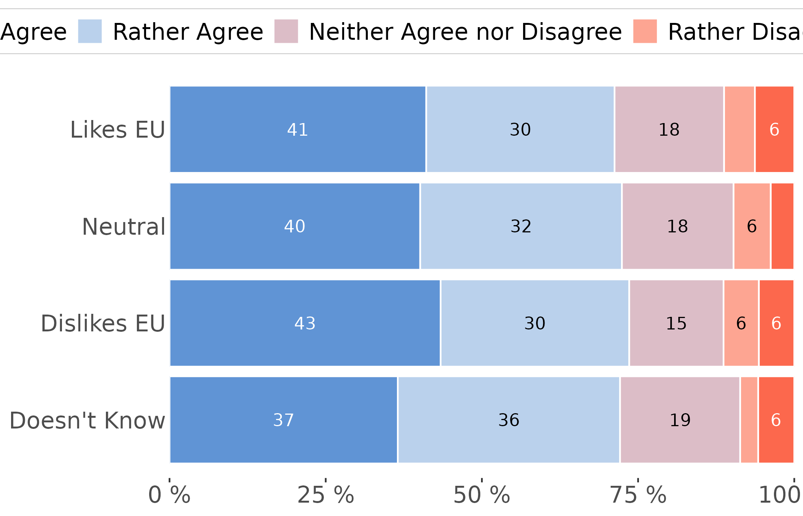

## Collapsing categories

`collapse_item` and `collapse_group` collapse (or rename) categories by
passing a named list, exactly as in
[`stem_summarise_cat()`](https://stem-cz.github.io/stemtools/reference/stem_summarise_cat.md).

``` r

stem_barstack(trust,
              item = police,
              group = eu_index,
              collapse_item = list(`Ano` = c("Definitely Agree", "Rather Agree"),
                                   `Ani ano, ani ne` = "Neither Agree nor Disagree",
                                   `Ne` = c("Rather Disagree", "Definitely Disagree")))
```

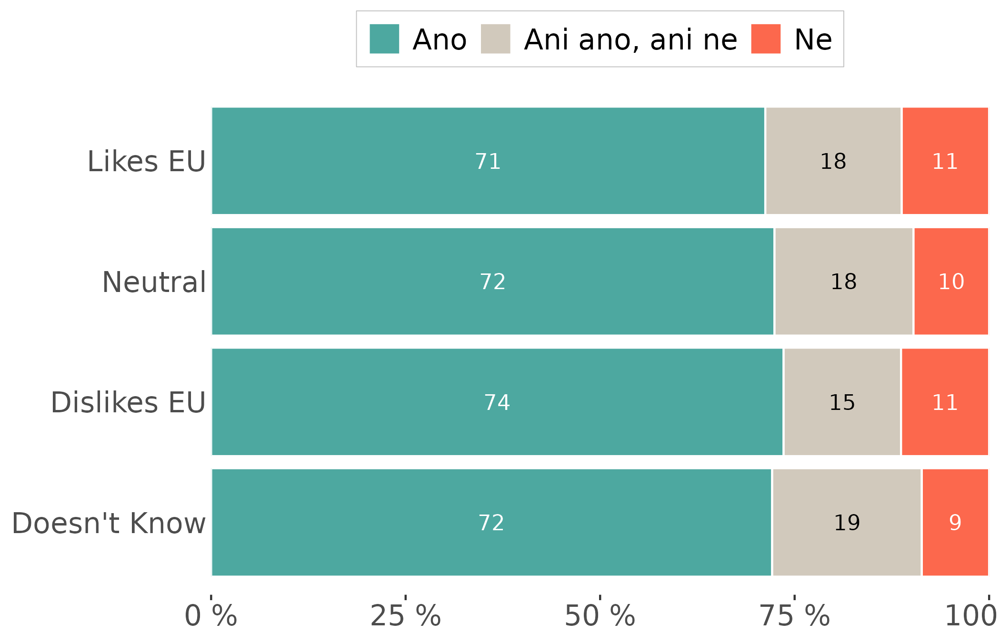

## Weights

If a `weight` variable is specified, weights are treated as survey
weights and passed into
[surveycore](https://github.com/JDenn0514/surveycore), which builds a
Taylor-series survey design. Manipulating that design uses
[surveytidy](https://jdenn0514.github.io/surveytidy/), whose verbs
mirror [dplyr](https://dplyr.tidyverse.org), so weighted and unweighted
code read the same way.

With unweighted data, the confidence intervals are computed using the
basic $`\sqrt{\frac{p \cdot (1-p)}{n}}`$ formula. With very small
proportions and small samples this can lead to bounds outside of the
`(0, 1)` range. With weighted data, the confidence intervals come from
[surveycore](https://github.com/JDenn0514/surveycore) using
Taylor-series linearization.

``` r

stem_barplot(trust, item = government, weight = W)
```

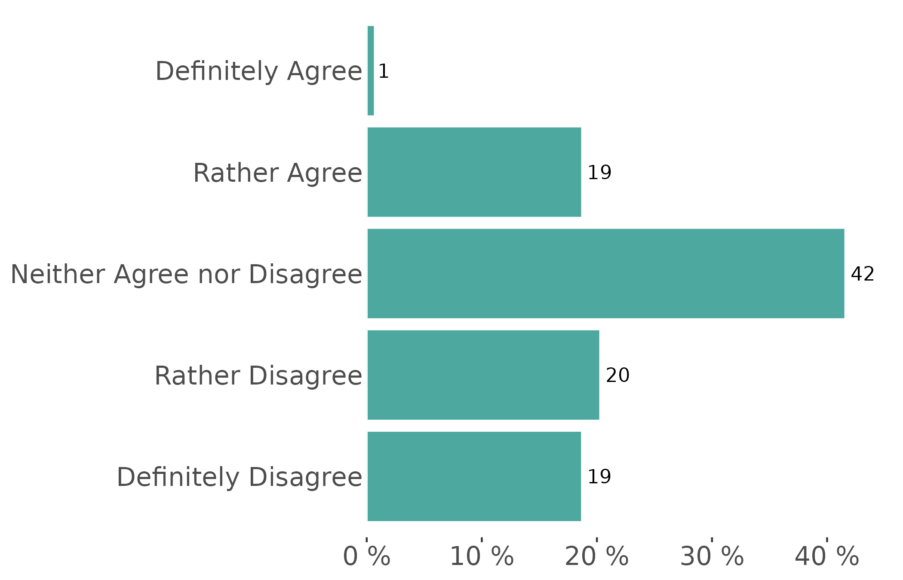

## Further customization

Every function returns a standard
[ggplot2](https://ggplot2.tidyverse.org) object, so you can keep adding
layers, scales and theme tweaks. The global
[`theme_stem()`](https://stem-cz.github.io/stemtools/reference/theme_stem.md)
is already applied, so this just layers a title on top:

``` r

stem_barplot(trust, item = government) +
  labs(title = "Trust in the government")
```

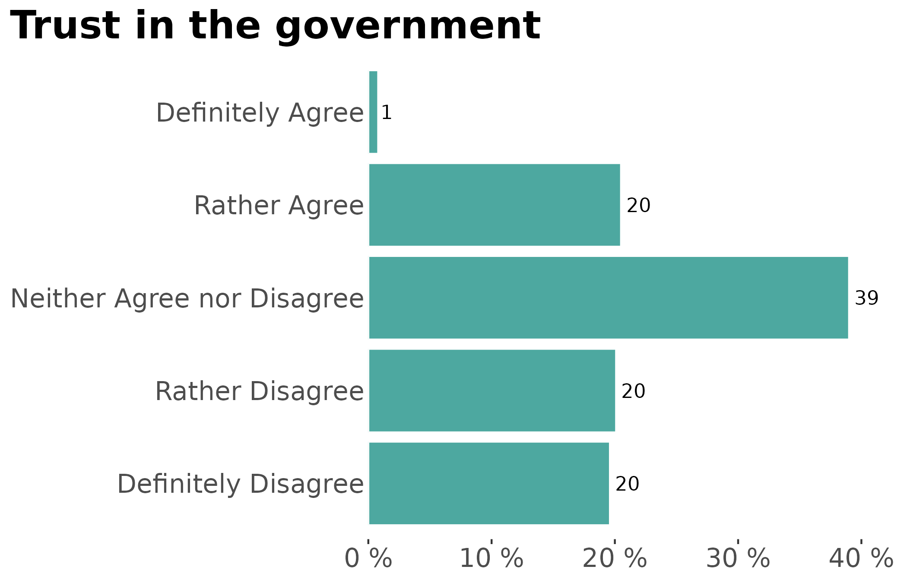
